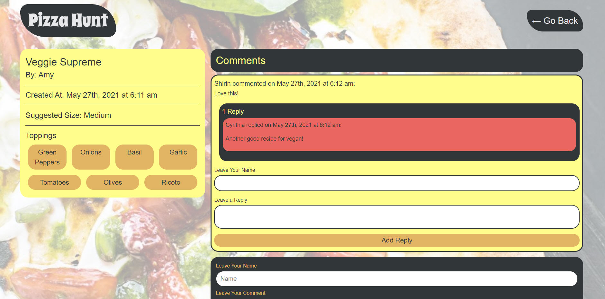

# pizza-hunt


## Description

Pizza Hunt is a social-media application that connects users with each other based on their love of pizza. In Pizza Hunt, users can share and discuss their dream pizza-topping combinations. Pizza is ubiquitous in everyday life all over the world, and this application has been created with the sole purpose of facilitating discussions about it.

In this application users are able to post the recipe of their favorite pizzas. They are also able to put comments and reply to comments in the discussion section for a single pizza. This application displays the count of comments and replies, so we can see which posts got more attention from users.

The application has IndexedDB functionality to locally save the created pizzas whenever the app is offline.

## Table of Contents

* [Description](#description)
* [Table of Contents](#table-of-contents)
* [Technologies](#technologies)
* [Usage](#usage)
* [License](#license)
* [Contributing](#contributing)
* [Tests](#tests)
* [Live-URL](#Live-URL)
* [Screenshots](#screenshots)
* [Questions](#questions)

## Technologies

* MongoDB
* Mongoose
* Express.js
* Dotenv
* JavaScript
* HTML
* CSS

## Usage

You can either use the application in production (checkout Live URL section) or install this project locally. For the latter, you need to install the following tools on your machine:

* Express.js (can be installed by running npm intall)
* MongoDB (checkout the following link: [MongoDB Download Center](https://www.mongodb.com/try/download/community))
* Mongoose (can be installed by running npm install)

 After installing MongoDB, run the following commands inside your terminal:

```bash
git clone <from-repository-on-github>
npm install
```

## License

[MIT](https://choosealicense.com/licenses/mit/)

## Contributing

Pull requests are welcome. For major changes, please first open an issue to discuss what you would like to change.

## Tests

You can use "Insomnia Core" or "Postman" to test different API routes for "Pizza", "Comment" and "Reply" models. The following routes have been implemented in the API:
1. Get all data
2. Get a single data using the ID
2. Post a new data
3. Put (update) a single data using the ID
4. Delete a single data using the ID

Another option for testing the application is to go to the "live url" in the next section and test the deployed application in production.

## Live-URL

This application is deployed on Heroku. Please checkout the following link: 
* [Live-URL](https://pizza-hunt-526.herokuapp.com/)


## Screenshots

Please see below for the screenshots of "homepage", "single pizza" and "add pizza" pages:

* Homepage:


* Single Pizza:



* Add Pizza:


## Questions

If you have any questions please use the following two links to contact me:

* [GitHub](https://github.com/sshahram)

* [Email Address](mailto:shirin.shahram23@gmail.com)